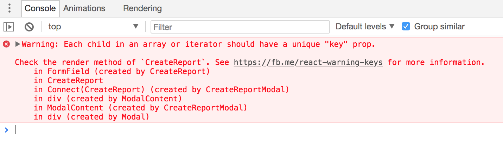

# React

## 🤔 리액트에서 사용하는 JSX 문법은 순수 자바스크립트가 아닌데 브라우저에서 어떻게 동작할 수 있는 걸까요?

> 우선 JSX는 필수일까요?

React에서 JSX는 필수가 아닙니다. 빌드 환경에서 컴파일 설정 (웹팩, 바벨)이 귀찮거나 하기 싫을 때는 JSX 없이 그냥 React로 코딩을 할 수 있습니다.

```js
// JSX를 사용하지 않는 예시입니다.
class Hello extends React.Component {
  render() {
    return React.createElement('div', null, `Hello ${this.props.toWhat}`);
  }
}

ReactDOM.render(
  React.createElement(Hello, {toWhat: 'World'}, null),
  document.getElementById('root')
);
```

`JSX` 문법은 우리가 자바스크립트안에 마크업 코드를 넣을 수 있게 해줍니다. 하지만 해당 코드는 브라우저에서 그대로 동작할 수 없기 때문에 브라우저가 이해할 수 있는 코드로 변경 시켜주어야 합니다.

`babel`은 최신 문법을 모든 브라우저에서 동작할 수 있는 예전 코드로 되돌리거나, 표준에서 벗어난 코드를 브라우저가 이해할 수 있는 코드로 변환해주는 트랜스파일러입니다.

`JSX` 문법은 `babel`을 통해서 브라우저가 이해할 수 있는 코드로 변경됩니다. React의 `createElement` 메서드를 통해서 DOM element를 만들 수 있습니다.

> 참고

- [JSX 없이 사용하는 React](https://ko.reactjs.org/docs/react-without-jsx.html)

## 🤔 리액트에서 배열에 `key` 속성은 왜 필요할까요?

```js
array.map(item => <Item key={item.key} />);
```

우리가 리액트를 사용하다보면 배열을 출력할 때 `map` 메서드를 통해서 출력을 많이합니다.
그 때 `key` 속성을 넣어주지 않으면 경고창이 뜨게 됩니다.



> 해당 `key` 프로퍼티는 리액트에서 제공해주는 속성입니다.
> React는 `key`를 통해 기존 트리와 이후 트리의 자식들이 일치하는지 확인합니다.

> Key는 React가 어떤 항목을 변경, 추가 또는 삭제할지 식별하는 것을 돕습니다. key는 엘리먼트에 안정적인 고유성을 부여하기 위해 배열 내부의 엘리먼트에 지정해야 합니다.

리액트 공식문서에서는 위와 같이 설명하고 있습니다.
말 그대로 리스트나 어떤 나열되어 있는 아이템들의 추가, 삭제와 같은 변경 성능을 조금 더 좋게 해줍니다. 리액트에서는 해당 성능 개선을 `key`를 통해서 하고 있죠.

만약에 리스트가 변경이 되지 않는다면 상관없지만, 삭제, 추가와 같은 변경사항이 많은 리스트라면 인덱스를 `key`로 부여하는 것은 피하세요.

이유는 리액트는 `key`를 `DOM`을 식별하는 키로 사용하고 있지만, 리스트의 인덱스를 `key`에 넣으면 변경이나 삭제가 될 때 리액트가 기대하는 `key` 값의 요소가 변경될 수 있습니다.

제가 참고로 올려드린 링크에서는 세 가지 조건을 만족하면 `key`로 인덱스를 사용해도 괜찮다고 합니다.

1. 리스트와 리스트 아이템들은 정적이고, 절대 변하지 않을 때
2. 리스트 아이템에 고유한 `id` 값이 없을 때
3. 리스트가 재조정되거나 필터링되지 않을 때

이런 경우가 아니라면 [nanoid](https://github.com/ai/nanoid/) 라이브러리를 통해서 리스트 아이템의 고유한 아이디를 만들어 `key` 값으로 부여하길 권장하고 있습니다.

### 참고

- [React keys](https://ko.reactjs.org/docs/reconciliation.html#keys)
- [React list key](https://ko.reactjs.org/docs/lists-and-keys.html#keys)
- [Index as a key is an anti-pattern](https://robinpokorny.medium.com/index-as-a-key-is-an-anti-pattern-e0349aece318)

## 🤔 HOC, Higher Order Component가 무엇일까요?

> 고차 컴포넌트는 컴포넌트의 로직을 재사용하기 위한 React의 고급 기술입니다.
> 쉽게 말해 고차 컴포넌트는 컴포넌트를 가져와서 새 컴포넌트를 반환하는 함수입니다.

기본적으로 함수 컴포넌트를 사용하면

```js
const Component = (props) => {
  /*
  * 컴포넌트 로직
  * ...
  */
  return (
    /*
    * 컴포넌트 뷰
    * ...
    */
  )
};
```

위와 같이 `props`를 받아서 뷰를 반환하는 것이 일반적인 컴포넌트입니다.

그에 반해 고차 컴포넌트는 컴포넌트를 반환합니다.

```js
// 고차 컴포넌트는 컴포넌트를 반환합니다.
const EnhancedComponent = higherOrderComponent(WrappedComponent);
```

고차 컴포넌트를 사용하는 예시는 보여주는 뷰는 비슷한데 사용하는 데이터가 다를 때 사용할 수 있습니다.

```js
// 이 함수는 컴포넌트를 매개변수로 받고..
function withSubscription(WrappedComponent, selectData) {
  // ...다른 컴포넌트를 반환하는데...
  return class extends React.Component {
    constructor(props) {
      super(props);
      this.handleChange = this.handleChange.bind(this);
      this.state = {
        data: selectData(DataSource, props)
      };
    }

    componentDidMount() {
      // ... 구독을 담당하고...
      DataSource.addChangeListener(this.handleChange);
    }

    componentWillUnmount() {
      DataSource.removeChangeListener(this.handleChange);
    }

    handleChange() {
      this.setState({
        data: selectData(DataSource, this.props)
      });
    }

    render() {
      // ... 래핑된 컴포넌트를 새로운 데이터로 랜더링 합니다!
      // 컴포넌트에 추가로 props를 내려주는 것에 주목하세요.
      return <WrappedComponent data={this.state.data} {...this.props} />;
    }
  };
}

/* 사용하는 법 */
const CommentListWithSubscription = withSubscription(
  CommentList,
  (DataSource) => DataSource.getComments()
);

const BlogPostWithSubscription = withSubscription(
  BlogPost,
  (DataSource, props) => DataSource.getBlogPost(props.id)
);
```

### 주의 사항

- 고차 컴포넌트 내부에서 인자로 받아온 컴포넌트의 프로토타입을 변경하지 않도록 합니다.
- `render` 함수 안에서 고차 컴포넌트를 사용하지 않도록 합니다. (성능 문제 = 한번 리렌더링 일어날 때 마다 새로운 고차 컴포넌트를 생성함)
- 정적 메서드는 따로 복사해야한다.
- `ref`는 전달되지 않는다. (`React.forwardRef`를 통해서 해결가능)

### 참고

- [higher order components | React](https://ko.reactjs.org/docs/higher-order-components.html)
